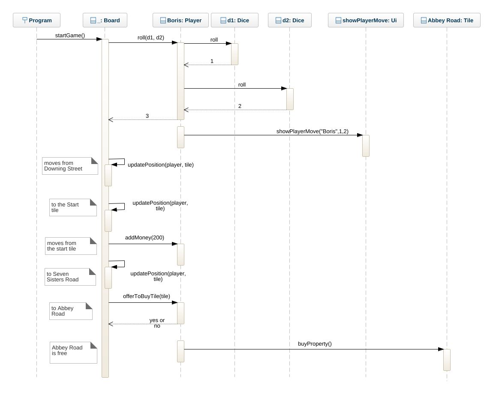

# The Monopoly Game

## Class Diagram
* The Board class take the control of game that´s because I´ve used association between it and of all other classes. Some other classes such as Dice and Player, Player with Ui I´ve used dependency relation because they need each other to be work and it provides a way to separate the creation of an object from its usage. Player class manage his individual income and expenses, store his property and record his movement. Ui class is responsible for all output information during the game and Tile class store a number of tiles and their name.

## Object Diagram
* The player gets a input name "Boris" and now he is currently located at "Downing Street" tile. This tile is before the start tile so that it´s the last tile. He gets the dice value and keeps moving to "Abbey Road" and he brought it save it in his property array. Some information of his movement during the whole the game, such as name, money, the number of move steps and properties will be displayed by Ui.
 
* Name = Boris.
* Money = 800.
* moveSteps = 3.
* properties = "Abbey Road"

## Sequence Diagram 
* Boris is currently located at "Downing Street" tile, he roll dice at the first turn and gets the value 1 and 2, so that he moves 3 steps to next tile "Start tile". He moves from "Start tile" to "Seven Sisters Road", as Boris has moved over the start tile, he receives 200 credits. And then Boris keeps moving to "Abbey Road". As the tile is free Boris is offered to buy this property at the start of his next round, but he needs to check if he has enough money before buys the property.

